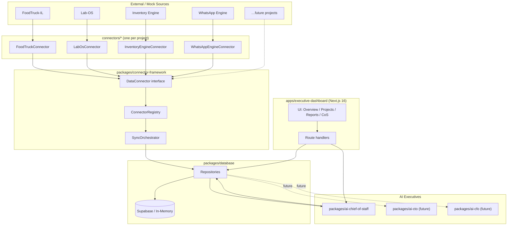

# AI-Company — System Architecture

## 1. Purpose

AI-Company is the operating system for an AI-Native company. The CEO is human. Every executive role (Chief of Staff, CTO, CFO, COO, VP Marketing, VP Sales) is an AI service that consumes the same shared data substrate and emits role-specific advisory output.

Phase 1 ships **one** executive (AI Chief of Staff) and the foundation everything else will plug into.

## 2. Architectural principles

1. **Project-agnostic core.** No package above `connectors/*` may import a project-specific package or hardcode a project name. The platform monitors N projects; today N is 4 and the architecture must hold at N=20.
2. **Connector pattern everywhere.** Every data source — current or future — is a `DataConnector`. The AI Chief of Staff (and every future executive) reads only normalized `ProjectStatus`, `ProjectMetric`, `Risk`, and `Opportunity` objects.
3. **Advisory only in Phase 1.** No executive service may write to external systems, approve spend, or take actions. The only side-effect allowed is writing reports/risks/opportunities into our own Supabase tables.
4. **Pluggable executives.** `ai-chief-of-staff` is a package, not a special case. Adding AI CTO later means dropping `packages/ai-cto/` with the same shape (collect → context → LLM → store report). The dashboard discovers executives at runtime through a registry.
5. **Two data modes.** The platform runs against either a real Supabase backend or an in-memory mock that satisfies the same `Repositories` interface. This keeps the dashboard demoable with zero infra and keeps tests fast.

## 3. High-level diagram

## 4. Runtime workflow

### 4.1 Sync (cron / on-demand)
1. `SyncOrchestrator` walks the `ConnectorRegistry`.
2. For each connector, it calls `getStatus`, `getMetrics`, `getRisks` in parallel with a per-connector timeout.
3. Results are normalized and upserted into `projects`, `project_metrics`, `risks`.
4. Failures are recorded on `data_sources.status` and `data_sources.last_sync` — never crash the run.

### 4.2 Briefing generation (AI Chief of Staff)
1. Load latest project snapshots, recent metrics, open risks/opportunities via `Repositories`.
2. Build a `CompanyContext` object (cross-project, normalized, no raw connector noise).
3. Call OpenAI with a structured-output prompt that returns a typed `ChiefOfStaffOutput`.
4. Persist as `executive_reports` row + new `risks` / `opportunities` rows linked to projects.
5. Dashboard reads the latest report by `report_type`.

### 4.3 Dashboard request
1. Server components fetch via `Repositories` (Supabase or mock — same interface).
2. Client components stay thin; no business logic on the client.
3. `/api/chief-of-staff/briefing` route triggers a fresh briefing on demand.

## 5. Boundaries — what each layer may and may not do

| Layer | May | May not |
| --- | --- | --- |
| `connectors/*` | Talk to project-specific APIs, parse raw data, return normalized types | Import other connectors; read Supabase; call LLMs |
| `connector-framework` | Define contracts, registry, orchestration, retries | Know about any specific project |
| `database` | Read/write Supabase; expose repository interfaces | Call LLMs; import connectors |
| `ai-chief-of-staff` | Read repositories, call OpenAI, write reports/risks/opportunities | Call any external system; import any connector by name |
| `executive-dashboard` | Render UI, trigger services via API routes | Contain business logic (lives in packages) |

## 6. Extending the platform

Adding a new project:
1. Create `connectors/<project>/` implementing `DataConnector`.
2. Register it in the connector registry (config or env).
3. Done — schema, dashboard, and Chief of Staff pick it up automatically.

Adding a new AI executive (CTO, CFO, …) in a later phase:
1. Create `packages/ai-<role>/` exporting an `Executive` with `name`, `generateReport(ctx)`.
2. Register it in the executive registry.
3. Add a tab to the dashboard's executive switcher. No changes to data layer or connectors.

## 7. What Phase 1 deliberately leaves out

- Auth / multi-tenant CEO accounts (single CEO assumed).
- Real connectors to live FoodTruck-IL, Lab-OS, etc. — all mock data.
- Action-taking executives — advisory only.
- Background job scheduler — sync runs on demand from the dashboard or CLI.
- Observability stack — log to console, structured.

These are deferred to keep the foundation honest and small. See [`roadmap.md`](roadmap.md).
