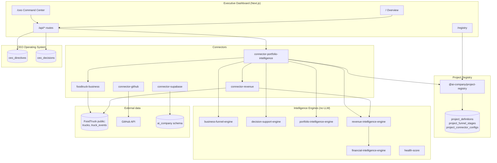
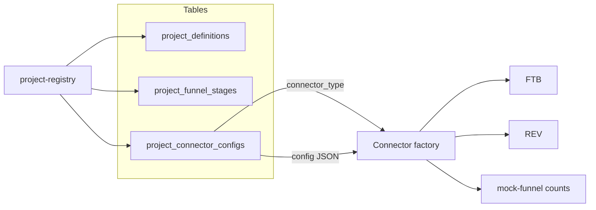

# AI-Company — Current System State (June 2026)

**Last updated:** 2026-06-03  
**Scope:** Phases 2–5B complete, Executive Command Center live, Phase 5C.1 CEO Operating System live.  
**Not implemented:** Phase 5C Financial Health Engine, autonomous execution, AI executive autonomy.

This document is the **single source of truth** for the platform as built.

---

## 1. System overview

AI-Company is a **deterministic executive intelligence platform** for a multi-project portfolio. It observes operational, funnel, revenue, and financial signals; surfaces recommendations; and records **CEO-in-the-loop** directives and decisions. It does **not** execute outreach, spend money, or run autonomous workflows.

### Design principles

| Principle | Implementation |
|-----------|----------------|
| Deterministic metrics | Engines compute scores; LLM explains only (Chief of Staff brief) |
| Registry-driven projects | `project-registry` + Supabase `ai_company` tables |
| Live vs mock labeling | `live` badges on portfolio, revenue, financial panels |
| CEO closed loop | Directives + decisions persisted in Supabase (5C.1) |
| No autonomous action | APIs write DB only; no webhooks to external systems |

---

## 2. Architecture (high level)



---

## 3. Monorepo structure

```
ai-company/
├── apps/
│   └── executive-dashboard/     # Next.js 16 CEO dashboard
├── packages/
│   ├── shared-types/          # Cross-cutting TypeScript contracts
│   ├── database/              # Repository layer (mock | supabase)
│   ├── project-registry/      # Project definitions loader
│   ├── business-funnel-engine/
│   ├── decision-support-engine/
│   ├── portfolio-intelligence-engine/
│   ├── revenue-intelligence-engine/
│   ├── financial-intelligence-engine/
│   ├── ai-chief-of-staff/     # Daily brief (LLM explain-only)
│   ├── ai-cto | ai-cfo | ai-coo | ai-vp-* | ai-executive-team/
│   ├── connector-framework/
│   ├── connectors/
│   │   ├── foodtruck-business/
│   │   ├── revenue/
│   │   ├── portfolio-intelligence/
│   │   ├── github/
│   │   └── supabase/
│   └── services/health-score/
├── connectors/                  # Legacy Phase 1 project connectors
│   ├── foodtruck-il/
│   ├── lab-os/
│   ├── inventory-engine/
│   └── whatsapp-engine/
└── supabase/migrations/         # ai_company schema DDL
```

**Package manager:** pnpm workspaces (`corepack pnpm`).

**Production data mode:** `AI_COMPANY_DATA_MODE=supabase` with `SUPABASE_SCHEMA=ai_company`.

---

## 4. Dashboard structure

| Route | Purpose |
|-------|---------|
| `/ceo` | **Executive Command Center** — single pane of glass + CEO OS |
| `/` | Overview — all intelligence panels + production metrics |
| `/registry` | Project registry (DB-backed definitions) |
| `/projects`, `/projects/[slug]` | Platform project list (legacy `projects` table) |
| `/chief-of-staff`, `/cto`, `/cfo`, `/coo`, `/vp-*` | AI executive briefing pages |
| `/reports` | Stored executive reports |

Navigation order: **Command Center** first, then Overview, Projects, Registry, Reports, executives.

---

## 5. Intelligence engines

| Engine | Package | LLM | Role |
|--------|---------|-----|------|
| Funnel | `business-funnel-engine` | No | Stage counts, conversions, bottlenecks |
| Decision support | `decision-support-engine` | No | Format recommended actions for CEO queue |
| Portfolio | `portfolio-intelligence-engine` | No | Aggregate per-project bundles; rank priorities |
| Revenue | `revenue-intelligence-engine` | No | Normalize currency, aggregate, brief lines |
| Financial | `financial-intelligence-engine` | No | Revenue → financial snapshots; trends (null without history) |
| Health score | `health-score` | No | Company health from GitHub + risks |

**Not built:** `financial-health-engine` (Phase 5C deferred).

---

## 6. Connectors

| Connector | Package | Live when |
|-----------|---------|-----------|
| `foodtruck-business` | `connectors/foodtruck-business` | FoodTruck Supabase URL + service role configured |
| `mock-funnel` | Via registry `connector_type` | Always mock stage counts |
| `connector-revenue` | `connectors/revenue` | Per `revenueSource` in registry config |
| `connector-github` | `connectors/github` | `GITHUB_TOKEN` + repo configured |
| `connector-supabase` | `connectors/supabase` | Platform Supabase credentials |
| `connector-portfolio-intelligence` | `connectors/portfolio-intelligence` | Orchestrates registry + engines |

**Revenue source types** (registry `config.revenueSource`):

- `foodtruck-supabase-events` — live event volume (FoodTruck-IL)
- `mock-revenue` — configured amounts (Lab-OS, Inventory, BurgerStop)
- `supabase-ledger` — `ai_company.revenue_transactions` (stub path)
- `stripe`, `erp`, `csv-import` — stub → zero/mock

---

## 7. Registry architecture



- **Source:** Supabase when `AI_COMPANY_DATA_MODE=supabase`; in-memory seed fallback.
- **Validation:** `loadAndValidate()` ensures stages and connector configs exist.
- **4 active projects:** foodtruck-il, lab-os, inventory-engine, burgerstop.

---

## 8. Executive Command Center (`/ceo`)

Added after Phases 5A–5B. Consolidates:

1. **Top highlights** — priority project, bottleneck, risk, top P1 action  
2. **Data maturity** — portfolio revenue, live/mock project counts  
3. **Weekly goals** — client-side checklist (localStorage)  
4. **Executive scorecard** — CEO, CTO, COO, CFO, Chief of Staff status  
5. **CEO Operating System (5C.1)** — directives, decisions on recommended actions, tracker  

Data loaders: `lib/command-center.ts`, `lib/ceo-operating-system.ts`, `loadPortfolioIntelligenceForDashboard()`.

---

## 9. Phase completion map

| Phase | Status | Deliverable |
|-------|--------|-------------|
| 2 Real data integration | ✅ | GitHub, Supabase platform, health score, production metrics |
| 3A Owner acquisition | ✅ | FoodTruck live trucks / activation |
| 3B Funnel engine | ✅ | Generic funnel per registry project |
| 3C Decision support | ✅ | CEO action queue (recommendations only) |
| 4A Portfolio intelligence | ✅ | Multi-project priorities + action queue |
| 4B Project registry | ✅ | DB tables + `@ai-company/project-registry` |
| 4C Registry cutover | ✅ | `source: database` in production |
| 5A Revenue intelligence | ✅ | Revenue connector + overview panel |
| 5B Financial intelligence | ✅ | Financial engine + panel; trends N/A without history |
| 5C.1 CEO operating system | ✅ | Directives, decisions, APIs, Command Center |
| 5C Financial health | ❌ Deferred | Not started |
| Executive Command Center | ✅ | `/ceo` route |

---

## 10. Key environment variables

| Variable | Purpose |
|----------|---------|
| `AI_COMPANY_DATA_MODE` | `mock` \| `supabase` |
| `SUPABASE_SCHEMA` | Default `ai_company` |
| `NEXT_PUBLIC_SUPABASE_URL` / `SUPABASE_SERVICE_ROLE_KEY` | Platform DB |
| `FOODTRUCK_SUPABASE_URL` / `FOODTRUCK_SUPABASE_SERVICE_ROLE_KEY` | FoodTruck app DB (`public`) |
| `GITHUB_TOKEN` | GitHub connector |
| `OPENAI_API_KEY` | Optional brief explanation |

---

## Related docs

- [PROJECT_INVENTORY.md](./PROJECT_INVENTORY.md)
- [DATABASE_INVENTORY.md](./DATABASE_INVENTORY.md)
- [DASHBOARD_INVENTORY.md](./DASHBOARD_INVENTORY.md)
- [../project-management/DATA_MATURITY_REPORT.md](../project-management/DATA_MATURITY_REPORT.md)
- [../project-management/NEXT_PHASE_RECOMMENDATION.md](../project-management/NEXT_PHASE_RECOMMENDATION.md)
