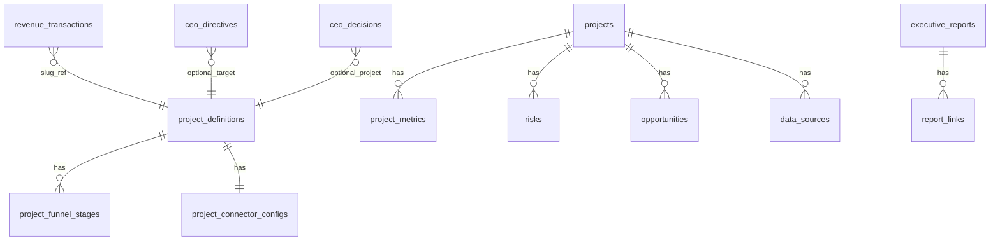

# AI-Company — Database Inventory (June 2026)

**Primary schema:** `ai_company` (PostgREST must expose this schema in Supabase Dashboard).

**Migrations:** `supabase/migrations/0001`–`0009`.

---

## Schema diagram (ai_company)

---

## Core platform (Phase 1 / 0003)

| Table | Purpose |
|-------|---------|
| `projects` | Legacy platform project records (dashboard project list) |
| `data_sources` | Connector sync status per project |
| `project_metrics` | Time-series metric name/value per project |
| `risks` | Open risks with severity |
| `opportunities` | Opportunities with priority |
| `executive_reports` | Stored AI executive briefings (JSON body) |
| `report_links` | Links reports to risks/opportunities/metrics |

---

## Project registry (Phase 4B — 0005, 0006)

| Table | Purpose |
|-------|---------|
| `project_definitions` | slug, name, description, status, enabled, sort_order |
| `project_funnel_stages` | Per-project stage id, label, order, **mock_count** |
| `project_connector_configs` | connector_type, enabled, **config** JSONB (revenueSource, unit economics, etc.) |

**Seeded projects:** foodtruck-il, lab-os, inventory-engine, burgerstop.

---

## Revenue (Phase 5A — 0007, 0008)

| Table | Purpose |
|-------|---------|
| `revenue_transactions` | Ledger for future `supabase-ledger` revenue source |

| Column | Notes |
|--------|--------|
| `project_slug` | Links to registry slug |
| `amount`, `currency` | Transaction amount |
| `is_recurring` | MRR-style line items |
| `occurred_at` | Reporting window filter |

**0008** seeds `revenueSource` on connector configs (not a separate table).

---

## CEO Operating System (Phase 5C.1 — 0009)

| Table | Purpose |
|-------|---------|
| `ceo_directives` | Standing CEO instructions and strategic overrides |
| `ceo_decisions` | CEO decisions on recommended actions (closed loop) |

### `ceo_directives`

| Column | Type | Notes |
|--------|------|--------|
| id | uuid | PK |
| created_at | timestamptz | |
| title | text | Required |
| directive | text | Required body |
| category | text | e.g. strategy, operations, override |
| priority | text | P1/P2/P3 |
| active | boolean | Default true |
| expires_at | timestamptz | Optional |
| is_override | boolean | Strategic override flag |
| target_project_id | text | Optional slug |

### `ceo_decisions`

| Column | Type | Notes |
|--------|------|--------|
| id | uuid | PK |
| created_at | timestamptz | |
| source_action_id | text | Links to funnel/decision action id |
| project_id | text | Registry slug |
| decision_title | text | |
| decision_description | text | Optional |
| decision_status | text | proposed, approved, rejected, deferred, in_progress, completed, cancelled |
| owner | text | Assignee |
| due_date | date | |
| priority | text | Default P2 |
| notes | text | |

**APIs:** `/api/ceo/directives`, `/api/ceo/decisions`, `/api/ceo/decisions/[id]` (PATCH).

---

## FoodTruck-IL source tables (external)

FoodTruck live connectors read the **FoodTruck application database** (typically `public` schema on a dedicated or shared Supabase project), **not** `ai_company`.

| Table | Used by | Purpose |
|-------|---------|---------|
| `trucks` | `connector-foodtruck-business`, `connector-revenue` (events proxy) | Registered trucks; status approved/pending/rejected |
| `truck_events` | `connector-revenue` (`foodtruck-supabase-events`) | Activity volume in reporting window |

**Revenue note:** Dollar amounts for FoodTruck-IL use registry-configured unit economics until a payments ledger exists. Event **counts** are live.

---

## Not implemented as tables

| Planned | Status |
|---------|--------|
| Financial health scores | Phase 5C — **not built** |
| Autonomous action log | Out of scope |
| Stripe/ERP raw imports | Connector stubs only |

---

## Migration index

| File | Contents |
|------|----------|
| 0001_init.sql | Public schema variant (legacy) |
| 0003_init_ai_company_schema.sql | Core ai_company tables |
| 0005_project_registry.sql | Registry tables |
| 0006_seed_project_registry.sql | Seed 4 projects |
| 0007_revenue_ledger.sql | revenue_transactions |
| 0008_seed_revenue_connectors.sql | Revenue config on connectors |
| 0009_ceo_operating_system.sql | ceo_directives, ceo_decisions |
